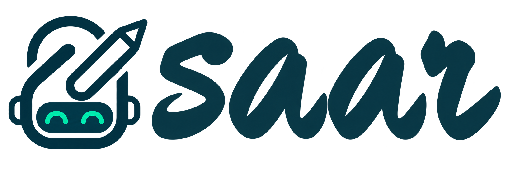
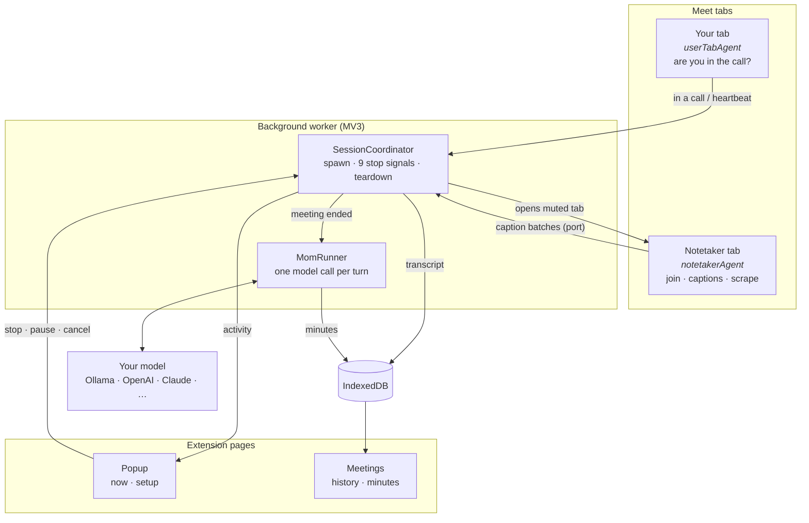

<p align="center">
  <picture>
    <source media="(prefers-color-scheme: dark)" srcset="assets/logo-lockup-dark.png">
    
  </picture>
</p>

<p align="center">
  AI note-taking for your meetings.
</p>

<p align="center">
  It sits in your calls, writes down what was said and who said it,<br>
  and turns it into a summary and minutes.
</p>

---

## What it does

Saar is a Chrome extension that takes notes in your Google Meet calls.

When you join a call, Saar opens a second, muted tab signed in as a notetaker
Google account, joins the meeting with its microphone and camera off, turns on
live captions, and records them as they arrive. When the meeting ends it hands
the transcript to a language model and writes the minutes.

- **Joins only after you do.** A Meet URL matches as soon as the pre-join screen
  loads, so Saar waits until it can see that you are actually *in* the call.
  Sitting in the green room deciding does not summon a notetaker.
- **Never joins live.** It refuses to press Join until it has confirmed both the
  microphone and the camera read as off. Not joining is better than joining
  audibly.
- **Knows when to stop.** Nine independent stop signals — you leaving, either tab
  closing, the bot being removed, captions drying up, a missed heartbeat — so a
  session cannot outlive the meeting even if your laptop sleeps or Chrome kills
  the worker.
- **Minutes with receipts.** Summary, topics, decisions and action items, and
  every action item carries the sentence it came from, so a small local model's
  output is checkable rather than taken on faith.
- **Yours by default.** Transcripts live in IndexedDB on your machine. The AI
  summary is off until you turn it on, and it defaults to a local Ollama, so
  nothing leaves the machine unless you point it somewhere else.
- **Survives being killed.** Summarising runs one model call at a time and
  persists between them. An MV3 worker dying mid-run costs one chunk, not the
  meeting. You can pause, resume or cancel a run at any point.

Google Meet today. The Meet-specific parts are isolated behind a port so Teams
and a headless cloud bot can follow.

## How to use it

### Install

Download the `.zip` from the [latest release][releases] and unzip it. Then open
`chrome://extensions`, turn on **Developer mode** (top right), click **Load
unpacked**, and choose the unzipped folder.

[releases]: https://github.com/IQSmartOrg/saar/releases/latest

### Set up

Saar joins as a *second* Google account, not as you — so you stay in the meeting
as yourself and the notetaker appears as its own participant. Sign that account
into the same Chrome profile, then open the Saar popup:

1. **Notetaker account** — pick it from the dropdown. Saar reads the accounts
   signed into this profile; hit **Refresh** if you have just added one.
2. **Summarise with AI** — optional. Off means you get transcripts and no
   minutes. On reveals the model settings:
   - **Provider** — Ollama, OpenAI, Claude, Groq, OpenRouter, LM Studio, or any
     OpenAI-compatible endpoint. Picking one fills in the URL and key; both stay
     editable.
   - **Test connection** — a green ✓ means it works and the model dropdown is
     populated. Do this before your first meeting rather than after.

Local Ollama is the default and needs no account or key.

### In a meeting

Join a Meet call as you normally would. Once you are in, a toast appears in the
corner saying Saar is joining — **Cancel** stops it, otherwise it joins on its
own after a few seconds. From then on it is hands-off.

The popup shows what Saar is doing right now: a live recording with a **Stop
notetaker** button, a summary being written with **Pause** and **Cancel**, or
finished minutes. **Open meetings** is the full history — search across every
transcript, read the minutes, copy either as Markdown, or download the whole
meeting as one `.md` file.

If a summary fails, the transcript is still saved. Nothing is lost, and
**Try again** re-runs it.

## Architecture

Ports and adapters. The domain modules know nothing about Chrome, and the Meet
automation knows nothing about the extension — which is what lets the same
joining and scraping code run under Puppeteer for a cloud bot later. Both
boundaries are enforced in CI by `dependency-cruiser` and ESLint, not by
convention.



### The modules

| | |
|---|---|
| `meet/` | Every assumption about Meet's DOM. Chrome-free, so it ports to Puppeteer unchanged. |
| `agents/` | The two scripts that run inside a Meet tab, wiring `meet/` to the extension. |
| `background/` | The worker: composition root, message routes, session lifecycle. |
| `bot/` | Spawning the notetaker tab. The seam a headless driver replaces. |
| `capture/` | Transcript segments in flight, and the batching that keeps writes sane. |
| `session/` | A meeting's life: registry, and the nine stop signals. |
| `processing/` | Transcript → minutes. `llm/` clients, `mom/` map-reduce, `job/` scheduling. |
| `minutes/` | The artefact itself, and Markdown export. |
| `settings/` | Configuration, and discovering the Google accounts on this profile. |
| `storage/` | The repository port and its IndexedDB adapter. |
| `messaging/` | The typed message bus every part talks over. |
| `ui/` · `utils/` | Shared presentation, and leaf helpers with no dependencies. |

Two things are worth knowing before changing anything. Meet rotates its class
names without notice, so every selector goes through a prioritised resolver
(`jsname` → icon → `aria-label` → text → CSS) that reports which layer matched —
drift is visible before capture breaks. And an MV3 service worker is terminated
after ~30 seconds idle, so anything that must outlive it is persisted and driven
by `chrome.alarms`, never by `setTimeout`.

## Contributing

```bash
git clone git@github.com:IQSmartOrg/saar.git
cd saar
npm install        # Node 22+
npm run dev        # loads an unpacked build with hot reload
```

Before opening a PR:

```bash
npm run check      # typecheck · lint · architecture boundaries · tests
```

This is exactly what CI runs, so a green `check` locally is a green PR. Work on a
branch and open the PR against `main`.

**What we look for**

- **Tests for anything where being wrong is invisible.** A broken selector, a
  status that silently reads as the wrong thing, a stop signal that never fires —
  these fail quietly and are the reason the suite exists.
- **Comments that explain why, not what.** Most non-obvious code here is
  non-obvious because of something we learned the hard way. Say what that was.
- **Respect the boundaries.** `npm run deps` fails if `meet/` reaches for a
  Chrome API or a domain module imports an entrypoint. If a rule is in your way,
  argue with the rule in the PR rather than routing around it.
- **Never report success you have not verified.** A function that returns `ok`
  without checking is worse than one that throws.

### Debugging a meeting that goes wrong

Every module logs through `utils/logger.ts` — one structured record per thing
that happens, carrying a timestamp, level, module, message, context and any
exception. It prints a readable line plus an expandable object, so DevTools
shows both.

```
[saar] 16:22:41.123 meet.join: clicked join            {label: "ask to join", needsAdmission: true}
[saar] ←bot 16:22:43.061 agents.notetaker: capturing
```

Levels map onto the console methods DevTools already filters by, so its
Verbose/Info/Warnings/Errors buttons work as-is:

| Method | Console | Use it for |
|---|---|---|
| `log.debug` | `console.debug` | per-tick detail — page state, health, flushes |
| `log.info` | `console.info` | something happened: joined, captured, queued |
| `log.warning` | `console.warn` | degraded but surviving — selector drift, no longer in call |
| `log.severe` | `console.error` | the thing failed |

Dev builds show `debug` and up; production starts at `info`. Override at
runtime from any console with `saarLogLevel('debug')`.

**Read the service worker's console, not the notetaker tab's.** The notetaker
runs in a hidden tab, and reading that tab's own console means clicking onto it
— which makes Chrome start rendering it, frequently the exact thing you are
diagnosing. Observing it changes it. So the notetaker forwards its records over
its port and the worker prints them, marked `←bot`. One console shows
everything, and reading it disturbs nothing.

Open `chrome://extensions` → **Saar** → click **`service worker`**.

The module name says where to look:

| Prefix | |
|---|---|
| `agents.userTab` | detecting that *you* joined a call |
| `bot.chromeTab` | opening and closing the notetaker tab |
| `agents.notetaker` | the notetaker's whole life, forwarded as `←bot` |
| `meet.join` · `meet.captions` · `meet.captionScraper` | the Meet DOM steps |
| `background.session` · `background.routes` | session lifecycle and message routing |
| `processing.mom` · `processing.llm.*` | transcript → minutes |
| `settings.googleAccounts` | the account dropdown |

Two things to look for when a join misbehaves. `meet.join` logs the resolver
layer that matched each control — drift from `jsname` down to `text` is an early
warning that Meet changed its DOM, visible before anything breaks, and `none`
means it was not found at all. And `agents.notetaker` logs the per-stage
timings on the way in:

```
in the meeting  {stages: "booting 4s → prejoin 4s → in-call 0s", controls: "mic:jsname ..."}
```

That is where the budgets in `meet/join.ts` should come from — measured on a
real meeting rather than guessed.

**After changing anything, reload the extension** at `chrome://extensions`. A
rebuild alone does nothing, and content-script changes only reach tabs opened
afterwards, so start a fresh meeting rather than reusing one.

**Releasing** is a manual workflow run: Actions → Release → enter a version like
`0.2.0`. It bumps the version, runs the full check, builds, cuts a
`release-<date>-<epoch>-<sha>` branch and publishes the zip to a GitHub Release.
The version committed on `main` is not kept in step — the tags are the record of
what has shipped.
